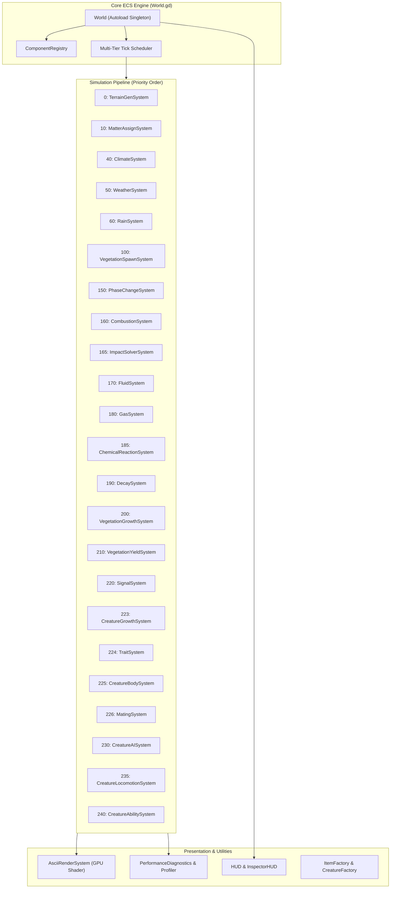

# Spire

**Spire** is a data-driven living world simulation built in [Godot 4.4](https://godotengine.org/) (GL Compatibility renderer) inspired by *Dwarf Fortress*, *RimWorld*, and *Cataclysm: Dark Days Ahead*.

The simulation runs on a 128×128 tile world grid (16,384 tiles) driven by a pure Entity-Component-System (ECS) architecture, a multi-tier turn-tick loop, continuous thermodynamic and physical material dynamics, sensory signal grids, and utility AI cognitive agents (vector embedding).

---

## Architecture Overview

### Core ECS Primitives
- [World.gd](file:///d:/GODOT/spire/core/World.gd): Central orchestrator and autoload singleton. Manages entity lifecycles, component delegation, spatial tile indexing (`Vector2i → entity_id`), multi-tier tick cadences, and microsecond system profiling.
- [ComponentRegistry.gd](file:///d:/GODOT/spire/core/ComponentRegistry.gd): High-performance sparse storage and component dictionary lookup per type symbol (`StringName → {entity_id: Component}`).
- [SystemBase.gd](file:///d:/GODOT/spire/core/SystemBase.gd): Base class for simulation systems with `initialize()`, `tick(tick_number)`, priority ordering, and hot toggle capability (`enabled`).
- [Query.gd](file:///d:/GODOT/spire/core/Query.gd): Fluent builder for querying entities by component requirements (`with_all`, `with_any`, `without`).

### Multi-Tier Ticking Architecture
To maintain stable 60+ FPS while simulating tens of thousands of entities and physical fields, Spire uses multi-cadence execution:
- **Standard Tick (10 TPS / 100ms budget)**: Real-time kinetic strikes, locomotion, sensory propagation, AI planning, and vital statistics.
- **Rare Tick (`is_rare_tick()`, every 20 ticks / ~2.0s)**: Sliced biological growth, material drying, decay, vegetation spread, and item yield evaluation.
- **Long Tick (`is_long_tick()`, every 50 ticks / ~5.0s)**: Macro seasonal climate shifts across 16,384 map tiles.
- **Sliced Distribution**: Heavy tile updates (e.g. Phase Change, Vegetation, Decay) are bucketed across 20–100 tick slices (~819 tiles/tick) to prevent hitching.

---

## Implemented Simulation Systems

The 21 simulation systems execute in ascending priority order on every active simulation tick:

### 1. World Generation & Terrain
| System | Priority | Script | Description |
|---|---|---|---|
| **TerrainGenSystem** | `0` | [TerrainGenSystem.gd](file:///d:/GODOT/spire/modules/terrain/systems/TerrainGenSystem.gd) | **Procedural Map Generator (One-shot).** Executes during initialization to generate the 128×128 map. Uses multi-pass `FastNoiseLite` (elevation, moisture, temperature) to construct local Plains biomes, meandering river channels, oxbow ponds, elevation gradients, and initial tile entities (`TileComponent`, `BiomeComponent`, `RenderComponent`). |

### 2. Weather & Climate
| System | Priority | Script | Description |
|---|---|---|---|
| **ClimateSystem** | `40` | [ClimateSystem.gd](file:///d:/GODOT/spire/modules/weather/systems/ClimateSystem.gd) | **Macro-Seasonal Engine.** Implements Dwarf Fortress-exact temporal intervals (1,200 ticks/day, 28,800 ticks/month, 100,800 ticks/season, 403,200 ticks/year). Calculates seasonal sinusoidal temperature variations (`season_temp_mod`), growth rate multipliers, and directional cloud drift vectors. |
| **WeatherSystem** | `50` | [WeatherSystem.gd](file:///d:/GODOT/spire/modules/weather/systems/WeatherSystem.gd) | **Atmospheric & Wind State.** Samples smooth 2D noise for continuous 360° wind direction and wind velocity. Manages barometric condition transitions (`CALM`, `BREEZY`, `WINDY`, `RAIN`, `STORM`) with weighted Markov probabilities and cooldown timers. |
| **RainSystem** | `60` | [RainSystem.gd](file:///d:/GODOT/spire/modules/weather/systems/RainSystem.gd) | **Precipitation & Hydrology Dynamics.** Advects a 2D rain noise field along the active wind vector. Deposits precipitation onto tiles, increases moisture, triggers evaporative cooling, saturates terrain into mud, and regulates puddle drying dynamics. |

### 3. Matter, Thermodynamics & Physical Mechanics
| System | Priority | Script | Description |
|---|---|---|---|
| **MatterAssignSystem** | `10` | [MatterAssignSystem.gd](file:///d:/GODOT/spire/modules/matter/systems/MatterAssignSystem.gd) | **Physical Matter Assignment.** Associates physical `MatterComponent` states with terrain tiles and dynamic entities based on `MaterialTypes` (density, hardness, specific heat, thermal conductivity, ignition points). Periodically synchronizes vegetation material states. |
| **PhaseChangeSystem** | `150` | [PhaseChangeSystem.gd](file:///d:/GODOT/spire/modules/matter/systems/PhaseChangeSystem.gd) | **Thermodynamic Transitions.** Slices 16,384 tiles across 20-tick cycles. Evaluates temperature vs. material melting/boiling points: handles liquid freezing (`FrozenComponent`), ice melting (`MeltedComponent`), evaporation into gas (`GasComponent`), and heat desiccation. |
| **CombustionSystem** | `160` | [CombustionSystem.gd](file:///d:/GODOT/spire/modules/matter/systems/CombustionSystem.gd) | **Fire & Thermal Propagation.** Resolves entities with `BurningComponent`. Consumes combustible fuel, outputs radiant heat to adjacent tiles, calculates 8-way fire spread based on flammability and moisture, and transitions burned-out tiles to charred ash. |
| **ImpactSolverSystem** | `165` | [ImpactSolverSystem.gd](file:///d:/GODOT/spire/modules/matter/systems/ImpactSolverSystem.gd) | **Universal Collision & Damage Solver.** Calculates kinetic strike mechanics (blunt impact, edge cutting, piercing, contact surface area, shear modulus, yield strength, fracture toughness). Simulates material fracturing, spalling, fluid splashing, acoustic signal emission, and entity structural damage. |
| **FluidSystem** | `170` | [FluidSystem.gd](file:///d:/GODOT/spire/modules/matter/systems/FluidSystem.gd) | **Hydraulic Flow Dynamics.** Simulates continuous liquid volumes (0.0 to 1.0) flowing downhill across 4-way topological elevations. Resolves fluid freezing, dynamic liquid pooling/puddles, and fluid ignition. |
| **GasSystem** | `180` | [GasSystem.gd](file:///d:/GODOT/spire/modules/matter/systems/GasSystem.gd) | **Atmospheric Dispersion.** Simulates gas expansion, concentration diffusion across 8 neighbors, density stratification, and steady dissipation. Deposits corrosive or toxic residues onto `ContaminantComponent`. |
| **ChemicalReactionSystem** | `185` | [ChemicalReactionSystem.gd](file:///d:/GODOT/spire/modules/matter/systems/ChemicalReactionSystem.gd) | **Corrosion & Chemical Breakdown.** Propagates acidic and corrosive fluids/gases. Degrades material yield strength over time, corrodes structural integrity, and breaks down vulnerable materials. |
| **DecaySystem** | `190` | [DecaySystem.gd](file:///d:/GODOT/spire/modules/matter/systems/DecaySystem.gd) | **Biological Spoilage & Rot.** Simulates organic matter rotting over 300-tick intervals. Factors in ambient temperature and freezing preservation. Transforms spoiled food/biomass into compost, humus, and odor/contaminant sources. |

### 4. Flora & Ecology
| System | Priority | Script | Description |
|---|---|---|---|
| **VegetationSpawnSystem** | `100` | [VegetationSpawnSystem.gd](file:///d:/GODOT/spire/modules/vegetation/systems/VegetationSpawnSystem.gd) | **Ecological Seeding (Tick 1).** Seeds initial vegetation based on biome, moisture, and soil fertility using a two-pass priority: trees (Pine, Oak) claim valid ground first, followed by understory flora (Grass, Tall Grass, Shrubs, Wildflowers). |
| **VegetationGrowthSystem** | `200` | [VegetationGrowthSystem.gd](file:///d:/GODOT/spire/modules/vegetation/systems/VegetationGrowthSystem.gd) | **Ontogeny & Seed Dispersal.** Progresses plant life stages (`Seedling → Young → Established → Mature`) using sliced per-tick execution. Scales growth rate by season and temperature, checks moisture survival limits, and simulates clonal/seed colonization onto compatible neighboring tiles. |
| **VegetationYieldSystem** | `210` | [VegetationYieldSystem.gd](file:///d:/GODOT/spire/modules/vegetation/systems/VegetationYieldSystem.gd) | **Harvestable Item Production.** Periodically harvests mature plants to deposit physical resources (grass clumps, sticks, logs) onto tile inventories (`InventoryComponent`). Enforces both local tile yield limits and global world caps to prevent memory bloat. |

### 5. Perception & Spatial Affordances
| System | Priority | Script | Description |
|---|---|---|---|
| **SignalSystem** | `220` | [SignalSystem.gd](file:///d:/GODOT/spire/modules/signal/systems/SignalSystem.gd) | **Sensory & Affordance Coordinator.** Maintains multi-channel spatial grids (`SignalGrid`) for food, hydration, lethal hazard, cover, sound impulses, and scent trails. Computes a fast 64-bit `TileAffordance` bitmask per tile (`WALKABLE`, `SWIMMABLE`, `WATER_SOURCE`, `FOOD_SOURCE`, `COVER_CONCEALMENT`, etc.) with pre-cached static baselines for zero-allocation AI queries. |

### 6. Fauna & Creature Simulation
| System | Priority | Script | Description |
|---|---|---|---|
| **CreatureGrowthSystem** | `223` | [CreatureGrowthSystem.gd](file:///d:/GODOT/spire/modules/creature/systems/CreatureGrowthSystem.gd) | **Creature Ontogeny & Growth.** Executes on rare ticks (every 20 ticks). Advances creature aging and growth based on nutrition. Handles life stage transitions (`Juvenile → Adult → Elder`), scales physical anatomical mass/organs proportionally, unlocks mature genetic traits, and promotes ASCII glyphs (`g → G`). |
| **TraitSystem** | `224` | [TraitSystem.gd](file:///d:/GODOT/spire/modules/creature/systems/TraitSystem.gd) | **Traits, Buffs & Debuffs.** Manages the lifecycles of genetic traits and temporary status conditions (`Well-Fed`, `Starving`, `Dehydrated`, `Exhausted`, `Panicked`, `Hypothermic`). Applies stat modifiers to metabolism, movement speed, and cognitive utility weighting. |
| **CreatureBodySystem** | `225` | [CreatureBodySystem.gd](file:///d:/GODOT/spire/modules/creature/systems/CreatureBodySystem.gd) | **Internal Anatomy & Physiology.** Simulates stomach digestion, metabolic hunger and thirst accumulation, blood circulation, hemorrhage/bleeding, limb condition, pain thresholds, mobility reduction, and mortality checks. |
| **MatingSystem** | `226` | [MatingSystem.gd](file:///d:/GODOT/spire/modules/creature/systems/MatingSystem.gd) | **Reproduction, Fecundity & Courtship.** Simulates biological sex (`Gender.MALE`, `Gender.FEMALE`), male/female genital limbs, libido drive accumulation, partner evaluation via trait matching, gestation timers, and birth spawning scaled by female spawnrate. |
| **CreatureAISystem** | `230` | [CreatureAISystem.gd](file:///d:/GODOT/spire/modules/creature/systems/CreatureAISystem.gd) | **Vector Utility AI & Cognitive Planner.** Samples spatial signals and tile affordances at the creature's position. Computes dot-product utility scores against state-space vector embeddings (`MindEmbeddings`) for actions (`FLEE`, `EAT`, `DRINK`, `REST`, `MATE`, `WANDER`, `IDLE`). Integrates diet-aware compatible food targeting, short-term and long-term memory to generate goal-oriented waypoints. |
| **CreatureLocomotionSystem** | `235` | [CreatureLocomotionSystem.gd](file:///d:/GODOT/spire/modules/creature/systems/CreatureLocomotionSystem.gd) | **Spatial Locomotion.** Navigates creatures along planned waypoints while respecting movement cooldowns and limb mobility. Emits acoustic movement signals and updates facing and position. |
| **CreatureAbilitySystem** | `240` | [CreatureAbilitySystem.gd](file:///d:/GODOT/spire/modules/creature/systems/CreatureAbilitySystem.gd) | **Ability & Action Execution.** Executes physical creature interactions (`EAT`, `DRINK`, `REST`, `ATTACK`) once movement reaches destination or interaction range. Consumes food matter according to diet category (`HERBIVORE`, `OMNIVORE`, `CARNIVORE`), quenches thirst, recovers fatigue under cover, and queues physical kinetic impacts. |

---

## Standalone Factories & Peripheral Subsystems

- [AsciiRenderSystem.gd](file:///d:/GODOT/spire/modules/rendering/systems/AsciiRenderSystem.gd): **GPU Shader-Driven Terminal Renderer.** Draws the entire 128×128 world in a single GPU draw call using a full-screen quad and custom GLSL shader (`ascii_screen.gdshader`). Updates three 128×128 `ImageTextures` (background color, foreground color, CP437 glyph index) only on simulation ticks. Wind waves, grass sway, flame flickering, cloud shadows, and rain droplet streaks run entirely on the GPU.
- [ItemFactory.gd](file:///d:/GODOT/spire/modules/item/systems/ItemFactory.gd): **Procedural Item Generation.** Factory for creating discrete, multi-part composite items (e.g. tools, weapons with separate blade and hilt materials). Computes composite density, mass, wear, and structural integrity, and manages global archetype population tracking.
- [CreatureFactory.gd](file:///d:/GODOT/spire/modules/creature/systems/CreatureFactory.gd): **Creature Assembly.** Procedural factory that configures creature entities with composite anatomical sub-parts (limbs, vital organs, blood reservoirs), utility drives, genetic traits, and sensory memory.
- [PerformanceDiagnostics.gd](file:///d:/GODOT/spire/modules/diagnostics/PerformanceDiagnostics.gd): **Real-Time Profiler.** Tracks microsecond execution latencies across all registered systems, frame pacing, FPS, 1% low FPS, tick hitch detection, and memory footprints. Can be exported via `F11`.
- [InspectorHUD.gd](file:///d:/GODOT/spire/ui/InspectorHUD.gd): **Tile & Entity Inspector.** Interactive split/tabbed UI (`I` or Left-Click). Provides deep telemetry for environment tiles (terrain, climate, active matter, vegetation, items, sensory signals, affordance flags) and creature internals (thoughts, drives, utility scores, anatomical health, blood volume, active traits).
- [HUD.gd](file:///d:/GODOT/spire/ui/HUD.gd): **Telemetry Overlay.** Debug dashboard (`F3` or `~`) displaying simulation tick rate, real-time FPS, global item and flora censuses, and live per-system microsecond latency breakdowns.

---

## Controls & Keybindings

| Key / Input | Action |
|---|---|
| **Left Click** | Inspect tile, ground items, or creature at mouse position |
| **I** / **Esc** | Toggle / close Inspector HUD |
| **Space** | Pause / unpause simulation |
| **+** / **=** | Double simulation tick speed (up to 200 TPS) |
| **-** | Halve simulation tick speed (down to 1 TPS) |
| **F3** / **`** (Tilde) | Toggle Performance & Census HUD |
| **F11** | Save performance diagnostics log to `user://diagnostics/` |
| **F12** | Reset profiler and hitch counters |
| **WASD** / **Middle Drag** | Pan camera view |
| **Mouse Wheel** | Zoom camera in / out |
